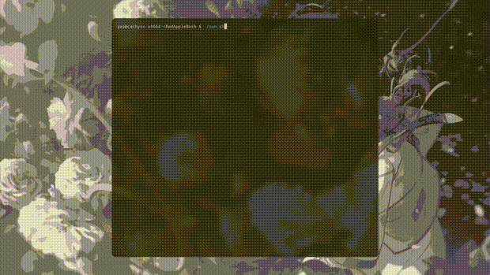

# Bad Apple!!



Bad Apple rendered entirely in ASCII art and played straight in your Linux terminal 
This script runs natively in bash showing the ["Bad Apple!!"](https://youtu.be/9lNZ_Rnr7Jc?si=ROgXrVvdx13oKPM4 video


## Installation

```bash
git clone https://github.com/yasbtw/BadApple.git
cd BadApple && ./run.sh
```

github.com/@yasbtw